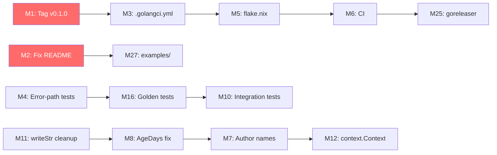

# Pareto Execution Plan — go-hotspot

**Created:** 2026-08-10 08:58 CEST
**Input sources:** `TODO_LIST.md` (26 items), status report 08-45 section (f) (50 items), docs-health self-review findings (6 gaps)
**Total consolidated tasks:** 37 unique work items (deduplicated by semantic intent)
**Format:** Markdown with mermaid.js execution graph (user-requested override of skill HTML/D2 default)

> Plans are point-in-time artifacts. When work is done, update `TODO_LIST.md` and `CHANGELOG.md`. Do NOT edit this plan — annotate it via docs-health ANNOTATE mode.

---

## Step 1: Pareto Breakdown

### The 1% that delivers 51% of the result (2 tasks)

These two tasks transform the project from **"broken — cannot be installed"** to **"usable — install works, docs are honest."** If you do nothing else, do these.

| # | Task | Why it's the 1% | Impact | Effort |
|---|------|-----------------|--------|--------|
| P1 | **Create git tag `v0.1.0`** | `go install ...@latest` in README literally fails. Zero tags exist. The tool is unusable by anyone who doesn't clone the repo. This is the single highest-leverage action — it unblocks every external user. | Critical | 5min |
| P2 | **Fix README "As a Go library" section** | The README claims go-hotspot is an "importable library" and shows a code example using `internal/` paths. These CANNOT be imported externally — the example won't compile. Anyone who tries it thinks the project is broken. This is a trust-destroying lie in the most-read file. | Critical | 30min |

### The 4% that delivers 64% of the result (5 tasks — the above 2 + 3 more)

Adding these three closes the quality gate and makes the project defensible against regression.

| # | Task | Why it's in the 4% | Impact | Effort |
|---|------|--------------------|--------|--------|
| P3 | **Add `.golangci.yml` + run lint verification** | The reporter refactor "fixed" 8 errcheck warnings that were never verified locally. Without enforced linting, every commit can silently introduce regressions. This is the quality gate. | Critical | 30min |
| P4 | **Add error-path test for `report.Render`** | Every renderer was refactored to return `error`. The happy path is tested. The error path is 100% untested — no test uses a failing writer. This is the highest-risk untested code in the project. A single `io.WriteString` failure would be silently swallowed if the refactor has a bug. | High | 30min |
| P5 | **Add `flake.nix`** | Required by project conventions (Lars's AGENTS.md: "use flake.nix for ALL build/task automation"). Without it, there is no reproducible build, no `nix run .#test`, no `nix run .#lint`. Every other quality task depends on having a build system. | High | 100min |

### The 20% that delivers 80% of the result (12 tasks — the above 5 + 7 more)

These seven tasks take the project from "barely working" to "production-quality CLI that a team can rely on."

| # | Task | Why it's in the 20% | Impact | Effort |
|---|------|---------------------|--------|--------|
| P6 | **Add GitHub Actions CI** | Without automated testing on push, the build can break at any time and nobody notices until a user reports it. CI is the safety net for all subsequent work. | High | 60min |
| P7 | **Surface author names in report** | The data already exists (`FileChurn.Authors` set, collected per file). Only the count is shown. Adding names is ~1 hour for a high-visibility user-facing improvement. Best effort-to-value ratio in the project. | Medium | 60min |
| P8 | **Fix `AgeDays()` zero-time contradiction** | `score.go:65` returns 0 for zero-time (looks "fresh") but Sort treats zero-time as oldest (`score.go:131`). The method and the sort actively disagree. This is a correctness bug that produces wrong rankings. | Medium | 30min |
| P9 | **Add benchmark tests** | README claims "fast" with zero evidence. No `go test -bench` exists. This either proves the claim or exposes it as false. Either way, it's essential for a tool whose selling point is speed. | Medium | 60min |
| P10 | **Add integration test with fixture git repo** | All git tests use string parsing of numstat output. Zero tests run against a real git repository. A parser change that breaks real-world repos (rename detection, binary files, merge commits) would pass all tests. | Medium | 100min |
| P11 | **Replace `writeStr` with `io.WriteString`** | `reporter.go:89` defines a one-line wrapper that adds indirection for zero benefit. Every caller could call `io.WriteString` directly. This is the simplest cleanup in the codebase — 20 minutes to eliminate an entire function. | Low | 12min |
| P12 | **Add `context.Context` to `git.Collect`** | `collector.go:59` runs `exec.Command` without cancellation. On a large monorepo (10k+ commits), analysis takes seconds. If the user hits Ctrl-C, the git process keeps running. This is a basic operability gap. | Medium | 60min |

### The remaining 20% to reach 100% (25 tasks)

Everything else — features, polish, documentation fixes, and nice-to-haves. Important for maturity but not for reaching "production-quality CLI."

---

## Step 2: Comprehensive Plan — Medium Granularity (30–100min per task)

**27 work packages**, sorted by impact/effort/customer-value. Each is independently shippable.

| # | Task | Pareto Tier | Impact | Effort | Category | Depends On |
|---|------|-------------|--------|--------|----------|------------|
| M1 | Create git tag `v0.1.0` + verify `go install` works | 1% | Critical | 30min | Release | — |
| M2 | Fix README "As a Go library" section — remove or fix `internal/` paths | 1% | Critical | 60min | Bug | — |
| M3 | Add `.golangci.yml` + run `golangci-lint run ./...` to verify zero findings | 4% | Critical | 30min | Quality | — |
| M4 | Add error-path test for `report.Render` (failingWriter for all renderers) | 4% | High | 30min | Testing | — |
| M5 | Add `flake.nix` with build/test/lint/devShell/format apps | 4% | High | 100min | Infrastructure | — |
| M6 | Add GitHub Actions CI (build/vet/test/race/lint on push + PR) | 20% | High | 60min | Infrastructure | M5 |
| M7 | Surface author names in all output formats (table, md, csv, json) | 20% | Medium | 60min | Feature | — |
| M8 | Fix `AgeDays()` zero-time contradiction (method vs sort disagreement) | 20% | Medium | 30min | Bug | — |
| M9 | Add benchmark tests for collect, analyze, score, render | 20% | Medium | 60min | Testing | — |
| M10 | Add integration test with fixture git repo (full pipeline) | 20% | Medium | 100min | Testing | — |
| M11 | Replace `writeStr` with `io.WriteString` calls | 20% | Low | 12min | Cleanup | — |
| M12 | Add `context.Context` to `git.Collect` for cancellation | 20% | Medium | 60min | Feature | — |
| M13 | Add content-based generated file detection (`// Code generated` header) | Remaining | Medium | 30min | Feature | — |
| M14 | Add `--fail-above` threshold exit code for CI gates | Remaining | Medium | 30min | Feature | — |
| M15 | Add `--output` flag for file output | Remaining | Medium | 30min | Feature | — |
| M16 | Add golden-file tests for all 4 output formats | Remaining | Medium | 60min | Testing | — |
| M17 | Add test coverage for `main.go` (filter logic + flag parsing) | Remaining | Medium | 100min | Testing | — |
| M18 | Fix docs-health gaps: harvest missing items, correct false annotations, DOMAIN_LANGUAGE | Remaining | Medium | 60min | Documentation | — |
| M19 | Run gofumpt formatting pass + add SPDX-License-Identifier headers | Remaining | Low | 30min | Cleanup | — |
| M20 | Add fuzz tests for `parseNumStat`, `splitNumStat`, `normalizeRename` | Remaining | Medium | 60min | Testing | — |
| M21 | Review all 38 branching-flow findings (only 5 reviewed) | Remaining | Medium | 60min | Quality | — |
| M22 | Review daemon auto-fixes (go-structure-linter 4 + gitignore-upserter 7) | Remaining | Low | 30min | Quality | — |
| M23 | Add `--min-commits` and `--author` filter flags | Remaining | Low | 60min | Feature | — |
| M24 | Verify DESIGN.md against code + rebuild CONTRIBUTING.md | Remaining | Low | 60min | Documentation | — |
| M25 | Add `goreleaser.yml` for automated releases | Remaining | Low | 100min | Infrastructure | M1, M6 |
| M26 | Diff CLI output before/after reporter refactor (byte-identical check) | Remaining | Medium | 30min | Quality | — |
| M27 | Add `examples/` directory with library usage examples | Remaining | Low | 30min | Documentation | M2 |

---

## Step 3: Detailed Breakdown — Fine Granularity (max 12min per task)

**109 subtasks**, sorted by execution priority within each parent task.

### M1: Create git tag `v0.1.0` (5 subtasks, 30min total)

| # | Subtask | Time |
|---|---------|------|
| 1.1 | Run `go build ./...` and `go test ./...` to confirm clean state | 2min |
| 1.2 | Verify `go.mod` module path `github.com/larsartmann/go-hotspot` is correct | 2min |
| 1.3 | Create annotated tag: `git tag -a v0.1.0 -m "Initial release"` | 2min |
| 1.4 | Add `[0.1.0] - 2026-08-10` section to CHANGELOG.md with current Unreleased content | 8min |
| 1.5 | Test: `go install github.com/larsartmann/go-hotspot/cmd/go-hotspot@v0.1.0` works | 5min |

### M2: Fix README "As a Go library" section (5 subtasks, 60min total)

| # | Subtask | Time |
|---|---------|------|
| 2.1 | Read current README library section (`README.md:126-143`) | 2min |
| 2.2 | Decision: packages stay `internal/` (CLI-only) OR move to public packages | 5min |
| 2.3 | Rewrite the section honestly — either "CLI-only, library API is internal" OR fix import paths | 12min |
| 2.4 | Update FEATURES.md "Importable packages" row to match decision | 5min |
| 2.5 | If packages moved: verify example compiles from a temp directory outside the module | 10min |

> **BLOCKED ON DECISION:** This task requires answering the question "Is go-hotspot a CLI or a CLI + library?" (see Questions below). The default assumption is: keep `internal/`, rewrite README to say "library API is module-internal for now; public API is a ROADMAP item."

### M3: Add `.golangci.yml` + verify lint (4 subtasks, 30min total)

| # | Subtask | Time |
|---|---------|------|
| 3.1 | Create `.golangci.yml` with: errcheck, revive, gosec, gofumpt, ineffassign, unused | 10min |
| 3.2 | Run `golangci-lint run ./...` and capture output | 5min |
| 3.3 | Fix any findings (or document exclusions with rationale in config) | 10min |
| 3.4 | Document lint command in AGENTS.md Commands section | 5min |

### M4: Add error-path test for `report.Render` (4 subtasks, 30min total)

| # | Subtask | Time |
|---|---------|------|
| 4.1 | Create `failingWriter` type in `reporter_test.go` that returns error on every Write | 5min |
| 4.2 | Write `TestRenderWriteError` — call Render with failingWriter for each format (table, md, csv, json) | 12min |
| 4.3 | Write `TestRenderCouplingWriteError` — call Render with couplings + failingWriter | 8min |
| 4.4 | Run `go test ./internal/report/ -run WriteError -v` and verify all pass | 5min |

### M5: Add `flake.nix` (7 subtasks, 100min total)

| # | Subtask | Time |
|---|---------|------|
| 5.1 | Read Lars's flake.nix pattern from another project (e.g., go-cqrs-lite, go-output) | 10min |
| 5.2 | Create `flake.nix` with inputs (nixpkgs, flake-utils) and base Go devShell | 12min |
| 5.3 | Add `apps.build` — runs `go build ./cmd/go-hotspot` | 5min |
| 5.4 | Add `apps.test` — runs `go test ./... -race -gcflags=all=-l` | 5min |
| 5.5 | Add `apps.lint` — runs `golangci-lint run ./...` (depends on M3) | 5min |
| 5.6 | Add `apps.format` — runs `gofumpt -w .` | 5min |
| 5.7 | Verify: `nix flake check` passes, `nix run .#test` runs tests, `nix develop` opens shell | 12min |

### M6: Add GitHub Actions CI (5 subtasks, 60min total)

| # | Subtask | Time |
|---|---------|------|
| 6.1 | Create `.github/workflows/ci.yml` with Go setup action | 10min |
| 6.2 | Add build job: `go build ./...` | 5min |
| 6.3 | Add test job: `go test ./... -race -gcflags=all=-l` | 5min |
| 6.4 | Add lint job: `golangci-lint run ./...` (depends on M3) | 10min |
| 6.5 | Add vet job: `go vet ./...` | 5min |
| 6.6 | Trigger on push to master + all PRs; verify YAML is valid | 10min |

### M7: Surface author names in report (6 subtasks, 60min total)

| # | Subtask | Time |
|---|---------|------|
| 7.1 | Add `AuthorNames []string` field to `hotspot.Result` (sorted from `FileChurn.Authors` set) | 10min |
| 7.2 | Populate in `Score()` by converting `Authors` set to sorted slice | 8min |
| 7.3 | Add to table output (truncate to top 3 names + "+N" if more) | 12min |
| 7.4 | Add to markdown, CSV, and JSON output formats | 12min |
| 7.5 | Update reporter tests to verify author names appear | 10min |
| 7.6 | Run `go test ./...` to verify all pass | 5min |

### M8: Fix `AgeDays()` zero-time contradiction (4 subtasks, 30min total)

| # | Subtask | Time |
|---|---------|------|
| 8.1 | Read `score.go:63-70` (AgeDays) and `score.go:131` (SortAge) to confirm contradiction | 5min |
| 8.2 | Decide: return `-1` or `math.MaxInt` for zero-time (signals "unknown age," not "fresh") | 5min |
| 8.3 | Fix `AgeDays()` to return `math.MaxInt32` for zero-time, update test | 10min |
| 8.4 | Run `go test ./internal/hotspot/` to verify age sort tests still pass | 5min |

### M9: Add benchmark tests (5 subtasks, 60min total)

| # | Subtask | Time |
|---|---------|------|
| 9.1 | Add `BenchmarkCollect` — parse a large fixture numstat string in `collector_test.go` | 12min |
| 9.2 | Add `BenchmarkAnalyze` — analyze the project's own largest `.go` file in `counter_test.go` | 12min |
| 9.3 | Add `BenchmarkScore` — score 1000-file result set in `score_test.go` | 12min |
| 9.4 | Add `BenchmarkRender` — render 1000-row table in `reporter_test.go` | 12min |
| 9.5 | Run `go test -bench=. -benchmem ./...` and capture results | 10min |

### M10: Add integration test with fixture git repo (6 subtasks, 100min total)

| # | Subtask | Time |
|---|---------|------|
| 10.1 | Create `testdata/fixture-repo/` directory with 3 small Go files | 10min |
| 10.2 | Initialize git repo in testdata, create 5 commits with known churn patterns | 12min |
| 10.3 | Write `TestIntegrationCollectFromRepo` — run `git.Collect` on fixture, verify expected stats | 12min |
| 10.4 | Write `TestIntegrationFullPipeline` — collect → analyze → score → render, verify end-to-end | 12min |
| 10.5 | Write `TestIntegrationCouplingFromRepo` — verify coupling detection on fixture with co-changes | 12min |
| 10.6 | Add fixture repo to `.gitignore` or commit it as testdata; run `go test ./internal/git/ -run Integration` | 10min |

### M11: Replace `writeStr` with `io.WriteString` (2 subtasks, 12min total)

| # | Subtask | Time |
|---|---------|------|
| 11.1 | Delete `writeStr` function, replace all call sites with `io.WriteString` | 8min |
| 11.2 | Run `go build ./...` and `go test ./internal/report/` to verify | 4min |

### M12: Add `context.Context` to `git.Collect` (5 subtasks, 60min total)

| # | Subtask | Time |
|---|---------|------|
| 12.1 | Add `ctx context.Context` as first parameter to `Collect()` and `parseNumStat()` | 10min |
| 12.2 | Use `exec.CommandContext(ctx, ...)` instead of `exec.Command(...)` | 10min |
| 12.3 | Add `ctx.Done()` check in parseNumStat scanner loop for early cancellation | 10min |
| 12.4 | Update `main.go` to pass `context.Background()` (or signal-aware context) | 10min |
| 12.5 | Update all tests and run `go test ./...` to verify | 12min |

### M13: Add content-based generated file detection (3 subtasks, 30min total)

| # | Subtask | Time |
|---|---------|------|
| 13.1 | Add `isGeneratedContent(path string) bool` — reads first line, checks for `// Code generated` | 12min |
| 13.2 | Update `fileFilter.keep()` to call both `isGenerated(path)` and `isGeneratedContent(path)` | 10min |
| 13.3 | Add test with a fixture file containing `// Code generated by protoc` header | 8min |

### M14: Add `--fail-above` threshold exit code (4 subtasks, 30min total)

| # | Subtask | Time |
|---|---------|------|
| 14.1 | Add `--fail-above float64` flag to `main.go` (default 0 = disabled) | 5min |
| 14.2 | After scoring, check if `MaxHotspot(results) > threshold` → return exit code 2 | 10min |
| 14.3 | Add `--fail-risk string` flag (e.g., "critical", "high") as alternative threshold | 10min |
| 14.4 | Document in README flags table and test the exit code | 5min |

### M15: Add `--output` flag (3 subtasks, 30min total)

| # | Subtask | Time |
|---|---------|------|
| 15.1 | Add `--output string` flag (default "" = stdout) | 5min |
| 15.2 | If set: open file, `defer file.Close()`, pass `file` as writer instead of `os.Stdout` | 12min |
| 15.3 | Document in README flags table | 5min |

### M16: Add golden-file tests for output formats (5 subtasks, 60min total)

| # | Subtask | Time |
|---|---------|------|
| 16.1 | Create `testdata/golden/` directory with expected output files for a known result set | 12min |
| 16.2 | Write `TestGoldenTable` — render known results, compare to `testdata/golden/table.txt` | 10min |
| 16.3 | Write `TestGoldenMarkdown`, `TestGoldenCSV`, `TestGoldenJSON` | 12min |
| 16.4 | Add `-update` flag to regenerate golden files when output intentionally changes | 10min |
| 16.5 | Run `go test ./internal/report/ -run Golden -v` and verify all pass | 10min |

### M17: Add test coverage for `main.go` (6 subtasks, 100min total)

| # | Subtask | Time |
|---|---------|------|
| 17.1 | Extract `run()` function logic into testable functions (if not already) | 12min |
| 17.2 | Write `TestFileFilter` — table-driven test for `keep()` with all filter combinations | 12min |
| 17.3 | Write `TestIsGenerated` — all suffix patterns + content-based detection | 10min |
| 17.4 | Write `TestParseComplexityMetric`, `TestParseChurnMetric` — all flag values | 10min |
| 17.5 | Write `TestSplitCSV` — comma-separated input, whitespace, empty values | 10min |
| 17.6 | Run `go test ./cmd/go-hotspot/` and verify coverage | 10min |

### M18: Fix docs-health gaps (6 subtasks, 60min total)

| # | Subtask | Time |
|---|---------|------|
| 18.1 | Read `.gitignore` and `.gitattributes` — verify contents are correct, update report 1 annotation d.7 honestly | 10min |
| 18.2 | Harvest 5 missing items from report 2 section (f) into TODO_LIST.md | 10min |
| 18.3 | Complete report 2 annotations — verify items 2, 3, 6, 8 (section d) against code | 12min |
| 18.4 | Move "Knowledge island" and "Bus factor" in DOMAIN_LANGUAGE — mark as "Not yet implemented" | 8min |
| 18.5 | Verify DESIGN.md data model section against actual Go structs | 10min |
| 18.6 | Rebuild CONTRIBUTING.md to reference lint config and full dev workflow | 10min |

### M19: Run gofumpt + add SPDX headers (3 subtasks, 30min total)

| # | Subtask | Time |
|---|---------|------|
| 19.1 | Run `gofumpt -w .` on all `.go` files | 5min |
| 19.2 | Add `// SPDX-License-Identifier: MIT` header to all `.go` files | 12min |
| 19.3 | Run `go build ./...` and `go test ./...` to verify nothing broke | 5min |

### M20: Add fuzz tests (4 subtasks, 60min total)

| # | Subtask | Time |
|---|---------|------|
| 20.1 | Write `FuzzParseNumStat` — fuzz `parseNumStat` with random byte sequences | 12min |
| 20.2 | Write `FuzzSplitNumStat` — fuzz `splitNumStat` with malformed lines | 12min |
| 20.3 | Write `FuzzNormalizeRename` — fuzz `normalizeRename` with git rename patterns | 12min |
| 20.4 | Run `go test -fuzz=FuzzParseNumStat -fuzztime=30s ./internal/git/` | 12min |

### M21: Review branching-flow findings (3 subtasks, 60min total)

| # | Subtask | Time |
|---|---------|------|
| 21.1 | Run `buildflow -s branching-flow --format finding` to see all 38 findings | 10min |
| 21.2 | Triage each: accept (fix code), reject (document rationale), or defer (move to ROADMAP) | 30min |
| 21.3 | Apply accepted fixes, document rejections in AGENTS.md conventions section | 20min |

### M22: Review daemon auto-fixes (3 subtasks, 30min total)

| # | Subtask | Time |
|---|---------|------|
| 22.1 | `git log --all --oneline -- .gitignore` — check what gitignore-upserter changed | 10min |
| 22.2 | Read current `.gitignore` and `.gitattributes` — verify rules are correct | 10min |
| 22.3 | Read go-structure-linter changes in git diff — verify structural changes are correct | 10min |

### M23: Add `--min-commits` and `--author` filter flags (5 subtasks, 60min total)

| # | Subtask | Time |
|---|---------|------|
| 23.1 | Add `--min-commits int` flag (default 0 = disabled), filter in main.go loop | 10min |
| 23.2 | Add `--author string` flag — check if name is in `FileChurn.Authors` set | 10min |
| 23.3 | Add filter logic to `fileFilter` or as post-score filter in main.go | 12min |
| 23.4 | Document both flags in README flags table | 8min |
| 23.5 | Run `go build ./...` and `go test ./...` to verify | 5min |

### M24: Verify DESIGN.md + rebuild CONTRIBUTING.md (4 subtasks, 60min total)

| # | Subtask | Time |
|---|---------|------|
| 24.1 | Diff DESIGN.md data model section against actual struct definitions in code | 15min |
| 24.2 | Update DESIGN.md where drifted (structs, fields, formulas) | 15min |
| 24.3 | Rewrite CONTRIBUTING.md: development setup, build/test/lint commands, code style pointers | 15min |
| 24.4 | Verify CONTRIBUTING.md commands work (trace through mentally) | 10min |

### M25: Add `goreleaser.yml` (5 subtasks, 100min total)

| # | Subtask | Time |
|---|---------|------|
| 25.1 | Read goreleaser Quick Start and create `.goreleaser.yml` | 12min |
| 25.2 | Configure builds: `cmd/go-hotspot` as main, CGO_ENABLED=0, linux/darwin/windows/amd64/arm64 | 12min |
| 25.3 | Add Homebrew tap formula section (if desired) | 12min |
| 25.4 | Add Nix flake output section (if desired) | 12min |
| 25.5 | Dry-run: `goreleaser release --snapshot --clean` and verify artifacts | 12min |

### M26: Diff CLI output before/after reporter refactor (3 subtasks, 30min total)

| # | Subtask | Time |
|---|---------|------|
| 26.1 | `git stash`, `git checkout d2c7507`, run `go-hotspot > old.txt`, `git checkout master` | 10min |
| 26.2 | Run `go-hotspot > new.txt`, then `diff old.txt new.txt` | 10min |
| 26.3 | If differences exist: either fix regressions or document as intentional changes | 10min |

### M27: Add `examples/` directory (3 subtasks, 30min total)

| # | Subtask | Time |
|---|---------|------|
| 27.1 | Create `examples/basic/` with a minimal `main.go` that calls `hotspot.Score` | 12min |
| 27.2 | Create `examples/coupling/` with a minimal `main.go` that calls `hotspot.Coupling` | 12min |
| 27.3 | Verify both examples compile: `go build ./examples/...` | 5min |

---

## Execution Graph

```mermaid
graph TD
    subgraph "1% — 51% of result"
        M1[M1: Create git tag v0.1.0]
        M2[M2: Fix README library section]
    end

    subgraph "4% — 64% of result"
        M3[M3: Add .golangci.yml + verify]
        M4[M4: Error-path reporter tests]
        M5[M5: Add flake.nix]
    end

    subgraph "20% — 80% of result"
        M6[M6: GitHub Actions CI]
        M7[M7: Surface author names]
        M8[M8: Fix AgeDays zero-time bug]
        M9[M9: Benchmark tests]
        M10[M10: Integration test with fixture repo]
        M11[M11: Replace writeStr]
        M12[M12: Add context.Context to Collect]
    end

    subgraph "Remaining 20% — 100%"
        M13[M13: Content-based generated detection]
        M14[M14: --fail-above exit code]
        M15[M15: --output flag]
        M16[M16: Golden-file tests]
        M17[M17: main.go test coverage]
        M18[M18: Fix docs-health gaps]
        M19[M19: Gofumpt + SPDX headers]
        M20[M20: Fuzz tests]
        M21[M21: Review branching-flow]
        M22[M22: Review daemon auto-fixes]
        M23[M23: --min-commits + --author]
        M24[M24: Verify DESIGN.md + CONTRIBUTING.md]
        M25[M25: Add goreleaser.yml]
        M26[M26: Diff CLI output pre/post refactor]
        M27[M27: Add examples/ directory]
    end

    M3 --> M6
    M5 --> M6
    M1 --> M25
    M6 --> M25
    M2 --> M27

    style M1 fill:#ff6b6b,color:#fff
    style M2 fill:#ff6b6b,color:#fff
    style M3 fill:#ffa502,color:#fff
    style M4 fill:#ffa502,color:#fff
    style M5 fill:#ffa502,color:#fff
    style M6 fill:#2ed573,color:#fff
    style M7 fill:#2ed573,color:#fff
    style M8 fill:#2ed573,color:#fff
    style M9 fill:#2ed573,color:#fff
    style M10 fill:#2ed573,color:#fff
    style M11 fill:#2ed573,color:#fff
    style M12 fill:#2ed573,color:#fff
```

### Recommended execution order (critical path)

---

## Summary Statistics

| Metric | Value |
|--------|-------|
| Total consolidated tasks | 37 unique items |
| Pareto 1% tasks (→51%) | 2 tasks, ~35min total |
| Pareto 4% tasks (→64%) | 5 tasks, ~165min total |
| Pareto 20% tasks (→80%) | 12 tasks, ~552min total |
| Remaining tasks (→100%) | 25 tasks, ~1330min total |
| Medium-grained work packages | 27 tasks (30–100min each) |
| Fine-grained subtasks | 109 subtasks (≤12min each) |
| Blocked tasks | M2 (decision needed), M25 (needs M1+M6) |

---

## Open Questions (cannot resolve without user)

### 1. Is go-hotspot a CLI or a CLI + library?

This blocks M2 (Fix README library section). All packages are under `internal/`, making them unimportable. Options:
- **(a) CLI-only:** Rewrite README to say "CLI tool, library API is internal." Move public library API to ROADMAP. Zero code changes.
- **(b) CLI + library:** Move `git`, `complexity`, `hotspot` out of `internal/` to make them importable. Breaking module restructure, but honest with the README.
- **(c) Hybrid:** Keep `internal/` but add thin public wrapper packages. Most work, least disruptive to existing code.

### 2. Should the competitive comparison table claims be empirically verified?

The README and DESIGN.md tables claim things like "code-inspector forces CGo even for Go." Report 1 admits these are research-based. Should I actually install and test each competitor to validate?

### 3. Homebrew/Nix tap for goreleaser?

M25 (goreleaser) can optionally publish to a Homebrew tap and/or Nix flake output. This requires a tap repo (e.g., `larsartmann/homebrew-tap`). Should I set this up, or skip the publish targets for now?
