# Pareto Execution Plan — go-hotspot Post-Docs-Health

**Created:** 2026-08-10 16:25 CEST
**Input sources:** `TODO_LIST.md` (17 items), status report `16-21` section f (50 items), `ROADMAP.md` (raw ideas), 7 annotated historical reports
**Total consolidated tasks:** 54 unique work items (deduplicated by semantic intent)
**Git remote:** `git@github.com:LarsArtmann/go-hotspot.git` — **CONFIGURED** (previously blocking, now resolved)
**HEAD:** `ae10ea7` — docs-health audit committed, working tree clean

> Plans are point-in-time artifacts. When work is done, update `TODO_LIST.md` and `CHANGELOG.md`. Do NOT edit this plan — annotate it via docs-health ANNOTATE mode.

---

## Step 1: Pareto Breakdown

### The 1% that delivers 51% of the result (2 tasks)

The project has a remote now but nothing has been pushed. The tag `v0.1.0` exists locally.
The README says `go install ...@latest` but no tag is on the remote. And the error system
we just built has a semantic lie that produces misleading user-facing messages. Fix these
two and the project goes from "invisible + has a lying error" to "installable + trustworthy."

| # | Task | Why it's the 1% | Impact | Effort |
|---|------|-----------------|--------|--------|
| P1 | **Push to remote (master + tags)** | The remote exists (`git@github.com:LarsArtmann/go-hotspot.git`) but nothing has been pushed. Zero commits, zero tags on GitHub. `go install` fails. CI never triggers. The project is invisible to the world. Pushing is the single highest-leverage action — it unblocks every external workflow. | Critical | 10min |
| P2 | **Fix `ReportRender("version output")` semantic lie** | `main.go:74` wraps a `--version` output failure as `ReportRender`, which renders a template saying "omit `--output`" and "check the output path." The user ran `--version` — they never asked for a report. This is a trust-destroying lie in the brand-new error system. | Critical | 30min |

### The 4% that delivers 64% of the result (5 tasks — the above 2 + 3 more)

Adding these three closes the most dangerous testing and documentation gaps in the project.

| # | Task | Why it's in the 4% | Impact | Effort |
|---|------|--------------------|--------|--------|
| P3 | **Add `classifyGitError()` table-driven tests** | `collector.go:193` has 5 branches of user-facing error classification (not-installed, not-a-repo, bad-revision, no-commits, default) with **zero test coverage**. This code decides what error message a user sees when git fails. If it breaks silently, every git error becomes a generic "something went wrong." | High | 60min |
| P4 | **Add README exit code table** | README has **zero exit code documentation** despite 6 distinct BSD codes (0, 1, 2, 65, 69, 70). Every CI pipeline author needs to know these. Without the table, users have to read source code to gate their pipelines. | High | 30min |
| P5 | **Verify DESIGN.md + update DOMAIN_LANGUAGE.md** | Both drifted from the error system migration (`31d6acb`). DESIGN.md's data model doesn't mention `internal/errors`. DOMAIN_LANGUAGE.md is missing 5+ error system terms (Family, Code, MessageTemplate, What/Why/Fix/WayOut). Core docs lying about the system's architecture. | High | 60min |

### The 20% that delivers 80% of the result (12 tasks — the above 5 + 7 more)

These seven take the project from "installable" to "production-defensible." They close
the testing gaps that would let regressions slip through, fix the worst code quality
issue, and ship the highest-impact features.

| # | Task | Why it's in the 20% | Impact | Effort |
|---|------|---------------------|--------|--------|
| P6 | **Wrap `context.Canceled` + `sc.Err()` in `parseNumStat`** | `collector.go:154` returns `ctx.Err()` bare. `collector.go:186` returns `sc.Err()` bare. Both break the typed error contract — they bypass `classifyGitError` entirely. A context cancellation produces a raw `context.Canceled` instead of a typed error. | Medium | 30min |
| P7 | **End-to-end exit code integration test** | No test verifies that `main()` actually calls `HandleError()` and exits with the right code. The unit tests verify `ExitCode()` in isolation, but the wiring is untested. A refactor could silently break exit codes and no test would catch it. | Medium | 60min |
| P8 | **Error message assertions + golden stderr test** | `errors_test.go` verifies `Code()` and `Classify()` but never asserts the actual message string. The What/Why/Fix/WayOut templates have no golden test. A typo in a template would ship unnoticed. | Medium | 60min |
| P9 | **Refactor `run()` in main.go** | `run()` has cyclomatic complexity 19 (max 12). It handles 8+ concerns: flag parsing, git collection, filtering, complexity analysis, scoring, sorting, output, threshold checking. This is the worst code quality issue in the project. | Medium | 100min |
| P10 | **Add `--no-header` + `--fail-risk` + `--version` before parse** | `--no-header` suppresses the summary for script piping. `--fail-risk` uses risk band names instead of float thresholds. `--version` currently requires successful flag parse. All three are small UX wins that users will ask for. | Medium | 60min |
| P11 | **Add coupling edge-case + CLI integration tests** | Mega-commit guard (>30 files), single-file commits, binary files are untested. `--fail-above`, `--output`, `--min-commits`, `--author` have no integration tests. These are the most impactful test gaps after classifyGitError. | Medium | 100min |
| P12 | **Add function-level hotspot ranking** | `FuncComplexity` data is collected per Go file (`counter.go:30`) but never surfaced. Dead data. Ranking individual functions — not just files — is the feature that differentiates go-hotspot from every competitor that just counts lines. | Medium | 100min |

### The remaining 20% to reach 100% (42 tasks)

Everything else — docs polish, infrastructure hardening, additional testing, future features,
and nice-to-haves. Important for maturity but not for reaching "production-defensible."

---

## Step 2: Comprehensive Plan — Medium Granularity (30-100min per task)

**27 work packages**, sorted by impact/effort/customer-value. Each is independently shippable.

| # | Task | Pareto Tier | Impact | Effort | Category | Depends On |
|---|------|-------------|--------|--------|----------|------------|
| M1 | Push to remote (master + v0.1.0 tag) + verify `go install` works | 1% | Critical | 30min | Release | — |
| M2 | Fix `ReportRender("version output")` semantic lie | 1% | Critical | 30min | Bug | — |
| M3 | Add `classifyGitError()` table-driven tests (5 branches) | 4% | High | 60min | Testing | — |
| M4 | Add README exit code table (0, 1, 2, 65, 69, 70) | 4% | High | 30min | Documentation | — |
| M5 | Verify DESIGN.md + update DOMAIN_LANGUAGE.md (error vocabulary) | 4% | High | 60min | Documentation | — |
| M6 | Wrap `context.Canceled` + `sc.Err()` in `parseNumStat` | 20% | Medium | 30min | Code Quality | — |
| M7 | End-to-end exit code integration test (3 scenarios) | 20% | Medium | 60min | Testing | M2 |
| M8 | Error message assertions + golden stderr test | 20% | Medium | 60min | Testing | — |
| M9 | Refactor `run()` — extract sub-functions (cyclop 19→<12) | 20% | Medium | 100min | Code Quality | — |
| M10 | Add `--no-header` + `--fail-risk` + `--version` before parse | 20% | Medium | 60min | Feature | — |
| M11 | Add function-level hotspot ranking for Go | 20% | Medium | 100min | Feature | — |
| M12 | Add coupling edge-case tests (mega-commit, binary, single-file) | 20% | Medium | 60min | Testing | — |
| M13 | CLI flag integration tests (`--fail-above`, `--output`, `--min-commits`, `--author`) | 20% | Medium | 100min | Testing | M10 |
| M14 | Use `.WithContext("path", path)` on analysis errors | Remaining | Low | 30min | Code Quality | — |
| M15 | Validate indentation complexity against known-complex files | Remaining | Medium | 100min | Research | — |
| M16 | SLOC counting — exclude closing braces | Remaining | Low | 30min | Bug | — |
| M17 | Run `erraudit` + check markdown links + verify 0 violations | Remaining | Medium | 30min | Quality | — |
| M18 | Docs polish: FEATURES ref, archived READMEs, CONTRIBUTING, 06-34 section b | Remaining | Low | 60min | Documentation | — |
| M19 | Fuzz tests: `classifyGitError` + `parseCommitMarker` | Remaining | Low | 60min | Testing | M3 |
| M20 | Property/benchmark tests: recencyWeight, orderedPair, Coupling, JSON, CSV | Remaining | Low | 100min | Testing | — |
| M21 | CI hardening: `erraudit nolint-audit`, `govulncheck`, `.erraudit.yaml` | Remaining | Low | 60min | Infrastructure | M1 |
| M22 | Add `--since-version TAG` + `--config` flags | Remaining | Low | 100min | Feature | — |
| M23 | Add knowledge-island / bus-factor detection | Remaining | Low | 100min | Feature | — |
| M24 | Add `dprint.json` + SPDX headers + SECURITY.md + CODE_OF_CONDUCT.md | Remaining | Low | 30min | Infrastructure | — |
| M25 | Add color output for terminal (risk bands when TTY) | Remaining | Low | 60min | Feature | — |
| M26 | Add shell completions (bash/zsh/fish) + man page | Remaining | Low | 100min | Feature | — |
| M27 | Deep-annotate remaining report sections b-e (13-52, 14-20, 15-38, 15-54) | Remaining | Low | 60min | Documentation | — |

---

## Step 3: Detailed Breakdown — Fine Granularity (max 12min per task)

**132 subtasks**, sorted by execution priority within each parent task.

### M1: Push to remote + verify go install (5 subtasks, 30min total)

| # | Subtask | Time |
|---|---------|------|
| 1.1 | Verify remote: `git remote -v` shows `origin git@github.com:LarsArtmann/go-hotspot.git` | 1min |
| 1.2 | Push master: `git push origin master` | 2min |
| 1.3 | Push tags: `git push origin --tags` | 2min |
| 1.4 | Verify on GitHub: repo has commits, tag v0.1.0 visible | 5min |
| 1.5 | Test install: `go install github.com/larsartmann/go-hotspot/cmd/go-hotspot@v0.1.0` from clean GOPATH | 10min |

### M2: Fix ReportRender semantic lie (3 subtasks, 30min total)

| # | Subtask | Time |
|---|---------|------|
| 2.1 | Read `main.go:74` — decide: create `CodeCLIOutput` constructor OR suppress with `//nolint:erraudit` | 5min |
| 2.2 | Apply fix: either new constructor + template in `errors.go`/`templates.go`, OR replace with bare `return err` + `//nolint:erraudit` | 12min |
| 2.3 | Run `go build && go test && erraudit ./...` to verify | 10min |

### M3: classifyGitError table-driven tests (5 subtasks, 60min total)

| # | Subtask | Time |
|---|---------|------|
| 3.1 | Read `classifyGitError()` at `collector.go:193` — map all 5 branches | 5min |
| 3.2 | Write `TestClassifyGitError` table struct with fields: name, cause, stderr, wantCode | 12min |
| 3.3 | Add cases: `exec.ErrNotFound`, "not a git repository", "ambiguous argument", "does not have any commits", default fallback | 12min |
| 3.4 | Add edge cases: empty stderr, whitespace-only stderr, multi-line stderr, nil cause | 12min |
| 3.5 | Run `go test ./internal/git/ -run ClassifyGitError -v` and verify all pass | 10min |

### M4: README exit code table (3 subtasks, 30min total)

| # | Subtask | Time |
|---|---------|------|
| 4.1 | Read `errors.go` exit-code constants + `templates.go` What/Why/Fix/WayOut to extract meanings | 5min |
| 4.2 | Write "Exit Codes" section in README.md with table: code, meaning, when, example | 12min |
| 4.3 | Verify table matches actual code — cross-check each code against `errors.go` constructors | 10min |

### M5: Verify DESIGN.md + update DOMAIN_LANGUAGE.md (6 subtasks, 60min total)

| # | Subtask | Time |
|---|---------|------|
| 5.1 | Read DESIGN.md data model section — diff struct definitions against actual Go code | 10min |
| 5.2 | Update DESIGN.md where drifted (add `internal/errors`, `classifyGitError`, `go-error-family`) | 10min |
| 5.3 | Read DOMAIN_LANGUAGE.md — identify missing error vocabulary | 5min |
| 5.4 | Add terms: Error Family, Error Code, MessageTemplate, What/Why/Fix/WayOut, BSD sysexits, classifyGitError | 12min |
| 5.5 | Verify each term matches code in `internal/errors/errors.go` and `templates.go` | 10min |
| 5.6 | Run `go build` to confirm no code drift introduced | 5min |

### M6: Wrap context.Canceled + sc.Err() (4 subtasks, 30min total)

| # | Subtask | Time |
|---|---------|------|
| 6.1 | Read `collector.go:154` (ctx.Err()) and `:186` (sc.Err()) to confirm bare returns | 5min |
| 6.2 | Wrap `context.Canceled`: return `errors.GitFailure("collect canceled", ctx.Err())` or handle explicitly in `Collect()` | 10min |
| 6.3 | Wrap `sc.Err()`: return `errors.GitFailure("scan numstat output", sc.Err())` | 5min |
| 6.4 | Run `go build && go test ./internal/git/` to verify | 5min |

### M7: End-to-end exit code integration test (5 subtasks, 60min total)

| # | Subtask | Time |
|---|---------|------|
| 7.1 | Write `TestExitCodeGitFailure` — run `run()` from non-repo dir, assert exit code 69 | 12min |
| 7.2 | Write `TestExitCodeThreshold` — run with `--fail-above 0.0001`, assert exit code 2 | 10min |
| 7.3 | Write `TestExitCodeUsage` — run with invalid flag, assert exit code 1 | 10min |
| 7.4 | Write `TestExitCodeSuccess` — run normally, assert exit code 0 | 10min |
| 7.5 | Run `go test ./cmd/go-hotspot/ -run ExitCode -v` and verify all pass | 8min |

### M8: Error message assertions + golden stderr (6 subtasks, 60min total)

| # | Subtask | Time |
|---|---------|------|
| 8.1 | Add message string assertions to `TestConstructors` in `errors_test.go` — verify `Error()` output | 12min |
| 8.2 | Create `TestHandleErrorOutput` — capture stderr for each of 11 error codes | 12min |
| 8.3 | Create `testdata/golden/stderr/` with expected output per error code | 10min |
| 8.4 | Add `-update-golden` flag support (reuse existing golden test pattern) | 5min |
| 8.5 | Run with `-update-golden`, review output, re-run to confirm stable | 10min |
| 8.6 | Run full test suite to verify no regressions | 5min |

### M9: Refactor run() (6 subtasks, 100min total)

| # | Subtask | Time |
|---|---------|------|
| 9.1 | Read `main.go` `run()` — identify the 8+ concerns and their boundaries | 10min |
| 9.2 | Extract `collectAndFilter(ctx, cfg) (*git.History, error)` — git collection + file filtering | 12min |
| 9.3 | Extract `analyzeAndScore(history, cfg) ([]hotspot.Result, error)` — complexity + scoring | 12min |
| 9.4 | Extract `sortAndFilterResults(results, cfg) []hotspot.Result` — sort + min-commits + author | 12min |
| 9.5 | Simplify `run()` to orchestration-only: call sub-functions, handle errors, render | 12min |
| 9.6 | Run `go build && go test && golangci-lint run ./cmd/` to verify cyclop < 12 | 10min |

### M10: Add --no-header + --fail-risk + --version before parse (6 subtasks, 60min total)

| # | Subtask | Time |
|---|---------|------|
| 10.1 | Add `--no-header` bool flag — suppress summary header in `run()` when set | 10min |
| 10.2 | Add `--fail-risk string` flag — map "critical"/"high"/"medium" to RiskBand thresholds | 12min |
| 10.3 | Move `--version` check before `flag.Parse()` — parse args manually for `--version` first | 10min |
| 10.4 | Update README flags table with new flags | 10min |
| 10.5 | Add unit tests for `--fail-risk` parsing | 10min |
| 10.6 | Run `go build && go test` to verify | 5min |

### M11: Function-level hotspot ranking (7 subtasks, 100min total)

| # | Subtask | Time |
|---|---------|------|
| 11.1 | Design: add `TopFunctions []FuncComplexity` to `hotspot.Result` (top N by cyclomatic) | 10min |
| 11.2 | Populate in `Score()` — sort functions by cyclomatic descending, take top 5 | 12min |
| 11.3 | Add `--top-functions` flag (default 5, max 20) to control how many per file | 10min |
| 11.4 | Add function names to table output (new column or sub-row under file) | 12min |
| 11.5 | Add to markdown, CSV (`top_functions` column), and JSON (`top_functions` array) | 12min |
| 11.6 | Write `TestFunctionLevelRanking` — verify functions sorted correctly, top N correct | 12min |
| 11.7 | Run `go build && go test` and verify golden files updated | 10min |

### M12: Coupling edge-case tests (5 subtasks, 60min total)

| # | Subtask | Time |
|---|---------|------|
| 12.1 | Write `TestCouplingMegaCommitGuard` — commit with >30 files excluded from coupling | 12min |
| 12.2 | Write `TestCouplingSingleFileCommit` — single-file commits don't create self-coupling | 12min |
| 12.3 | Write `TestCouplingBinaryFiles` — binary file entries don't break parsing | 12min |
| 12.4 | Write `TestCouplingCanonicalization` — (A,B) and (B,A) produce same pair | 10min |
| 12.5 | Run `go test ./internal/hotspot/ -run Coupling -v` and verify | 10min |

### M13: CLI flag integration tests (6 subtasks, 100min total)

| # | Subtask | Time |
|---|---------|------|
| 13.1 | Write `TestFailAboveExitCode` — `--fail-above 0.0001` returns exit code 2 | 12min |
| 13.2 | Write `TestOutputToFile` — `--output /tmp/test.txt` writes report to file | 12min |
| 13.3 | Write `TestMinCommitsFilter` — `--min-commits 5` excludes files with <5 commits | 12min |
| 13.4 | Write `TestAuthorFilter` — `--author "Alice"` filters to Alice's files only | 12min |
| 13.5 | Write `TestNoHeader` — `--no-header` suppresses summary output | 10min |
| 13.6 | Run full integration test suite and verify all pass | 10min |

### M14: Use .WithContext on analysis errors (3 subtasks, 30min total)

| # | Subtask | Time |
|---|---------|------|
| 14.1 | Read `errors.go:90-97` — `AnalysisRead`/`AnalysisParse` embed path in message via `WrapCorruptionf` | 5min |
| 14.2 | Add `.WithContext("path", path)` to both constructors, keeping message for backwards compat | 12min |
| 14.3 | Run `go build && go test ./internal/errors/` to verify | 10min |

### M15: Validate indentation complexity (5 subtasks, 100min total)

| # | Subtask | Time |
|---|---------|------|
| 15.1 | Select 10 known-complex files (deep nesting, many branches) and 10 known-simple files | 12min |
| 15.2 | Run `go-hotspot --complexity indentation` on each, capture scores | 12min |
| 15.3 | Compare scores against known complexity ranking — compute Spearman correlation | 12min |
| 15.4 | Document findings in a brief calibration note — is `indentation/4 + 1` adequate? | 12min |
| 15.5 | If correlation is poor: propose alternative formula or document as known limitation | 12min |

### M16: SLOC counting — exclude closing braces (3 subtasks, 30min total)

| # | Subtask | Time |
|---|---------|------|
| 16.1 | Read `counter.go:62` — identify brace-counting logic in SLOC counter | 5min |
| 16.2 | Exclude lines that are only `}` (after trimming whitespace) | 12min |
| 16.3 | Update `TestCountLines` expectations and run `go test ./internal/complexity/` | 10min |

### M17: Run erraudit + check markdown links (4 subtasks, 30min total)

| # | Subtask | Time |
|---|---------|------|
| 17.1 | Run `erraudit ./...` — verify 0 violations in CI mode | 5min |
| 17.2 | Run `erraudit ./... --no-suppress` — review 3 suppressed violations for staleness | 5min |
| 17.3 | Grep all `.md` files for `[...](...)` links — verify each resolves to a real file | 10min |
| 17.4 | Fix any broken links found | 5min |

### M18: Docs polish (6 subtasks, 60min total)

| # | Subtask | Time |
|---|---------|------|
| 18.1 | Update FEATURES.md "v0.1.0" reference — note HEAD is ahead, link to CHANGELOG `[Unreleased]` | 5min |
| 18.2 | Create `docs/status/archived/README.md` — explain: historical snapshots, don't edit | 5min |
| 18.3 | Create `docs/planning/archived/README.md` — same | 5min |
| 18.4 | Add error handling patterns section to CONTRIBUTING.md | 12min |
| 18.5 | Strike through 06-34 section b table rows (author names, generated detection now done) | 10min |
| 18.6 | Review `examples/coupling/main.go` compiles with current API | 10min |

### M19: Fuzz tests (4 subtasks, 60min total)

| # | Subtask | Time |
|---|---------|------|
| 19.1 | Write `FuzzClassifyGitError` — feed random stderr strings, verify no panic | 12min |
| 19.2 | Write `FuzzParseCommitMarker` — feed random commit delimiters, verify no panic | 12min |
| 19.3 | Run each fuzz target for 30s — `go test -fuzz=FuzzClassifyGitError -fuzztime=30s` | 12min |
| 19.4 | Run full test suite to verify no regressions | 5min |

### M20: Property/benchmark tests (7 subtasks, 100min total)

| # | Subtask | Time |
|---|---------|------|
| 20.1 | Write `TestRecencyWeightMonotonic` — older commits always get less weight | 12min |
| 20.2 | Write `TestOrderedPairCanonical` — (A,B) and (B,A) produce identical keys | 10min |
| 20.3 | Write `BenchmarkCoupling` — benchmark on 100-file, 100-commit fixture | 12min |
| 20.4 | Write `BenchmarkFullPipeline` — collect → score → render end-to-end | 12min |
| 20.5 | Write `TestJSONOutputStructure` — verify `jsonHotspot`, `jsonCoupling`, `jsonSummary` fields | 12min |
| 20.6 | Write `TestCSVEscaping` — paths with commas, quotes, newlines | 12min |
| 20.7 | Run all new tests + benchmarks and verify | 10min |

### M21: CI hardening (5 subtasks, 60min total)

| # | Subtask | Time |
|---|---------|------|
| 21.1 | Add `erraudit nolint-audit` step to `.github/workflows/ci.yml` | 10min |
| 21.2 | Add `govulncheck ./...` step to CI | 10min |
| 21.3 | Create `.erraudit.yaml` config — formalize enforcement flags | 12min |
| 21.4 | Pin Go version in CI to `1.26.5` explicitly | 5min |
| 21.5 | Verify CI YAML is valid: `yamllint .github/workflows/ci.yml` | 10min |

### M22: Add --since-version + --config flags (6 subtasks, 100min total)

| # | Subtask | Time |
|---|---------|------|
| 22.1 | Add `--since-version string` flag — pass to `git log` as `<tag>..HEAD` range | 12min |
| 22.2 | Verify git range works with `Collect()` — may need format change | 12min |
| 22.3 | Add `--config string` flag — read `.go-hotspot.yaml` for default flag values | 12min |
| 22.4 | Write minimal YAML parser (or use stdlib JSON as config format to stay zero-dep) | 12min |
| 22.5 | Update README flags table | 10min |
| 22.6 | Run `go build && go test` to verify | 5min |

### M23: Knowledge-island / bus-factor detection (5 subtasks, 100min total)

| # | Subtask | Time |
|---|---------|------|
| 23.1 | Design: add `KnowledgeIsland bool` and `BusFactor int` to `hotspot.Result` | 12min |
| 23.2 | Implement knowledge island: file where single author ≥ 95% of commits | 12min |
| 23.3 | Implement bus factor: minimum authors needed to cover 80% of commits | 12min |
| 23.4 | Add to output formats (table column, JSON field) | 12min |
| 23.5 | Write tests for both metrics | 12min |

### M24: dprint.json + SPDX + SECURITY.md + CODE_OF_CONDUCT.md (5 subtasks, 30min total)

| # | Subtask | Time |
|---|---------|------|
| 24.1 | Create `dprint.json` with Go formatting config | 5min |
| 24.2 | Add `// SPDX-License-Identifier: MIT` to all `.go` files | 5min |
| 24.3 | Create `SECURITY.md` — reporting policy | 5min |
| 24.4 | Create `CODE_OF_CONDUCT.md` — standard Contributor Covenant | 5min |
| 24.5 | Run `go build` to verify SPDX headers don't break anything | 5min |

### M25: Color output for terminal (4 subtasks, 60min total)

| # | Subtask | Time |
|---|---------|------|
| 25.1 | Detect TTY: `term.IsTerminal(int(os.Stdout.Fd()))` — only colorize when interactive | 10min |
| 25.2 | Map risk bands to colors: critical=red, high=orange, medium=yellow, low=green | 12min |
| 25.3 | Add `--no-color` flag to disable colorization explicitly | 10min |
| 25.4 | Test with `go-hotspot | cat` (no color) vs `go-hotspot` (color) | 10min |

### M26: Shell completions + man page (5 subtasks, 100min total)

| # | Subtask | Time |
|---|---------|------|
| 26.1 | Generate bash completion script — `go-hotspot completion bash` subcommand | 12min |
| 26.2 | Generate zsh completion script | 12min |
| 26.3 | Generate fish completion script | 12min |
| 26.4 | Write man page (`go-hotspot.1`) with SYNOPSIS, DESCRIPTION, FLAGS, EXIT CODES, EXAMPLES | 12min |
| 26.5 | Document completions + man page installation in README | 10min |

### M27: Deep-annotate remaining report sections (5 subtasks, 60min total)

| # | Subtask | Time |
|---|---------|------|
| 27.1 | Annotate `13-52` sections b-e — strike through resolved items | 12min |
| 27.2 | Annotate `14-20` sections b-e — strike through resolved items | 12min |
| 27.3 | Annotate `15-38` sections b-e — strike through resolved items | 12min |
| 27.4 | Annotate `15-54` sections b-e — strike through resolved items | 12min |
| 27.5 | Review all annotations for "so what?" test — each must cite evidence | 10min |

---

## Execution Graph

```mermaid
graph TD
    subgraph "1% — 51% of result"
        M1[M1: Push to remote + verify go install]
        M2[M2: Fix ReportRender semantic lie]
    end

    subgraph "4% — 64% of result"
        M3[M3: classifyGitError tests]
        M4[M4: README exit code table]
        M5[M5: Verify DESIGN.md + DOMAIN_LANGUAGE]
    end

    subgraph "20% — 80% of result"
        M6[M6: Wrap ctx.Canceled + sc.Err]
        M7[M7: End-to-end exit code test]
        M8[M8: Error msg assertions + golden stderr]
        M9[M9: Refactor run]
        M10[M10: --no-header + --fail-risk + --version]
        M11[M11: Function-level hotspot ranking]
        M12[M12: Coupling edge-case tests]
        M13[M13: CLI flag integration tests]
    end

    subgraph "Remaining 20% — 100%"
        M14[M14: .WithContext on errors]
        M15[M15: Validate indentation complexity]
        M16[M16: SLOC exclude braces]
        M17[M17: Run erraudit + check links]
        M18[M18: Docs polish]
        M19[M19: Fuzz tests]
        M20[M20: Property/benchmark tests]
        M21[M21: CI hardening]
        M22[M22: --since-version + --config]
        M23[M23: Knowledge-island / bus-factor]
        M24[M24: dprint + SPDX + SECURITY + CONDUCT]
        M25[M25: Color terminal output]
        M26[M26: Shell completions + man page]
        M27[M27: Deep-annotate reports]
    end

    M2 --> M7
    M3 --> M19
    M10 --> M13
    M1 --> M21

    style M1 fill:#ff6b6b,color:#fff
    style M2 fill:#ff6b6b,color:#fff
    style M3 fill:#ffa502,color:#fff
    style M4 fill:#ffa502,color:#fff
    style M5 fill:#ffa502,color:#fff
```

---

## Total Effort Summary

| Pareto Tier | Tasks | Total Effort | Cumulative Impact |
|-------------|-------|-------------|-------------------|
| 1% (51%) | M1, M2 | 60min | Critical → installable + trustworthy |
| 4% (64%) | M3, M4, M5 | 150min | + tested classification + documented exits |
| 20% (80%) | M6-M13 | 610min | + production-defensible quality bar |
| Remaining (100%) | M14-M27 | 980min | + maturity, polish, advanced features |
| **Total** | **27 tasks** | **~30 hours** | **Full project maturity** |

---

*Plan generated at 2026-08-10 16:25 CEST. Point-in-time snapshot — annotate, never rewrite.*
