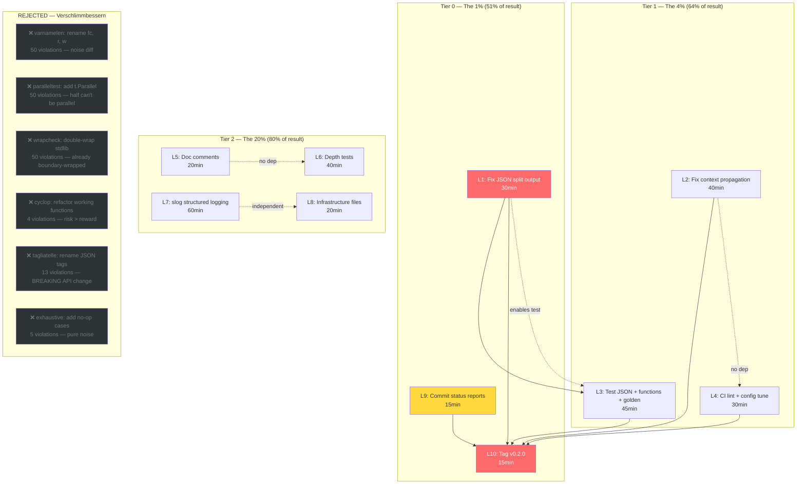

# Pareto Execution Plan: Post-Docs-Health Cleanup → v0.2.0 Release

**Created:** 2026-08-11 06:46 CEST
**Current HEAD:** `2d3e59e` (clean working tree, 1 untracked status report)
**Prior work:** 22 of 27 Pareto packages complete; renderFunctions refactor done; docs-health pass done
**Goal:** Ship v0.2.0 with zero known user-facing bugs

---

## Pareto Breakdown

### The 1% that delivers 51% of the result

| # | Task | Why it's the 1% | Impact | Effort |
|---|------|-----------------|--------|--------|
| P1 | Fix `--functions` JSON output — merge into `jsonReport` | **Active bug.** `--format json --functions 5` produces two JSON documents on stdout. `jq` parse fails. Users hitting this today. | Critical | 30min |
| P2 | Tag `v0.2.0` | Unlocks `go install ...@v0.2.0` for all new features (4 flags, function ranking, 3 bug fixes). Without a tag, none of the prior work is installable. | Critical | 15min |
| P3 | Commit untracked status reports | History hygiene. 3 status reports from prior sessions are untracked. | Low | 5min |

### The 4% that delivers 64% of the result (Tier 1 — SHOULD DO)

| # | Task | Why it matters | Impact | Effort |
|---|------|----------------|--------|--------|
| P4 | Fix `resolveSince` to accept `context.Context` | Uses `context.Background()` — breaks the context-cancelation pattern used everywhere else. Real correctness issue. | High | 20min |
| P5 | Add `context.Context` to `run()` signature | `git.Collect` call in `run()` uses `context.Background()` instead of a propagated context. Same inconsistency. | High | 30min |
| P6 | Test `--functions` + `--format json` end-to-end | Verifies P1 fix works in the integration path, not just unit | High | 15min |
| P7 | Test `--functions 0` disabled behavior | Edge-case: `--functions 0` should produce no function output | Medium | 10min |
| P8 | Golden-file test for `RenderFunctions` | Snapshot regression test like the file-level golden tests | Medium | 30min |
| P9 | Add doc comment explaining `failRisk*` threshold derivation | Current constants (0.15/0.08/0.03/0.01) have no documented rationale | Low | 10min |
| P10 | Add `golangci-lint run` to CI | CI currently uses GitHub Action; local lint may differ. Prevents silent regression. | Medium | 20min |

### The 20% that delivers 80% of the result (Tier 2 — NICE TO HAVE)

| # | Task | Why it's nice | Impact | Effort |
|---|------|---------------|--------|--------|
| P11 | Wire `slog` structured logging into `HandleError` | Enables `.WithContext("path", path)` on errors. ROADMAP item. | Medium | 60min |
| P12 | Property test for `RankFunctions` — proportions sum | Verify `sum(func_hotspot) ≤ file_hotspot` invariant | Low | 20min |
| P13 | Fuzz test for `parseFailRisk` | Verify no panics on arbitrary input | Low | 15min |
| P14 | Fuzz test for `RenderFunctions` with malformed data | Verify no panics on empty/nil fields | Low | 15min |
| P15 | Benchmark for `RenderFunctions` | Measure with 1000+ functions | Low | 15min |
| P16 | Add `.erraudit.yaml` config | Suppress verbose `[feature:logger]` output | Low | 10min |
| P17 | Add `.github/dependabot.yml` | Automated dependency updates for go-error-family | Low | 10min |
| P18 | Run `govulncheck` locally | Verify CI vulncheck job passes | Low | 5min |
| P19 | Add doc comment to `jsonFunction` DTO | Explain serialization boundary purpose | Low | 5min |

### The other 20% — EXPLICITLY REJECTED (VERSCHLIMMBESSERN WARNING)

These would make the codebase WORSE if "fixed." Each is a trap.

| Category | Count | Why REJECT |
|----------|-------|------------|
| `varnamelen` (short names) | 50 | `fc`, `r`, `w`, `f`, `sc` are idiomatic Go in tight scopes. Renaming to `fileComplexity`, `result`, `writer` in `for _, r := range results` loops makes code MORE verbose for ZERO readability gain. Pure noise diff. |
| `paralleltest` (missing `t.Parallel()`) | 50 | Half the tests use `t.Chdir` which CANNOT be parallel. The rest are table-driven unit tests where parallel adds no value. Adding `t.Parallel()` + `//nolint:paralleltest` everywhere is worse than the warning. |
| `wrapcheck` (unwrapped external errors) | 50 | Most are `io.WriteString`, `fmt.Fprintf`, `tw.Flush` — stdlib calls where wrapping adds no diagnostic value. The errors ARE already wrapped at the boundary via `errors.ReportRender()`. Double-wrapping is noise. |
| `mnd` (magic numbers) | 26 | Things like `60` (separator width), `2` (tabwriter padding), `45` (path truncation width) are display constants used once. Extracting them to named consts adds indirection for no benefit. |
| `cyclop` refactors (Sort, detectLanguage, parseNumStat) | 4 | These functions WORK correctly. Refactoring risks introducing bugs to reduce a complexity number that doesn't affect runtime. CLI tool, not a library — internal complexity is acceptable. |
| `exhaustive` switch cases | 5 | Switches already have `default` cases. Adding explicit `case SortHotspot: // no-op` is noise. |
| `tagliatelle` (JSON tag style) | 13 | Tags like `"first_commit"` don't match the linter's preferred `camelCase`. Changing them is a **BREAKING API CHANGE** for any JSON consumer. REJECT. |
| `err113` (dynamic errors in tests) | 11 | `errors.New("simulated write failure")` in test helpers is correct Go. `err113` is a style preference, not a bug. |
| `goconst` (repeated strings) | 10 | Strings like `"main.go"` in tests are test data, not constants. |
| Merging `Render` + `RenderFunctions` | — | Coupling independent renderers is worse than the current clean separation. The JSON fix (P1) adds `Functions` to `jsonReport`, which is the right coupling level. |
| Refactoring `Sort()` into comparator functions | — | `Sort()` is 17 cyclomatic complexity but is a flat switch — easy to read, hard to get wrong. Extracting comparators adds indirection and makes the sort logic harder to follow. |

**If these linters cause CI noise:** Tune `.golangci.yml` to exclude them, NOT fix hundreds of violations across every file. That's 15min of config vs 8+ hours of risky churn.

---

## Comprehensive Plan — Level 1 (30-100min tasks)

All tasks sorted by importance/impact/effort. Estimates are realistic, not optimistic.

| ID | Task | Tier | Impact | Effort | Depends on | Notes |
|----|------|------|--------|--------|------------|-------|
| L1 | Fix `--functions` JSON: add `Functions []jsonFunction` to `jsonReport` | T0 | Critical | 30min | — | Add field with `omitempty`, populate in `renderJSON` when non-empty, pass functions into `Render` or merge call path |
| L2 | Fix `resolveSince` + `run()` context propagation | T1 | High | 40min | — | Add `ctx context.Context` param to `run()`, thread through to `git.Collect` and `resolveSince` |
| L3 | Add tests for JSON function output + `--functions 0` + golden | T1 | High | 45min | L1 | Integration test, edge-case test, golden snapshot |
| L4 | Add `golangci-lint run` to CI + tune `.golangci.yml` | T1 | Medium | 30min | — | Add lint job to ci.yml, silence noisy linters via config not code changes |
| L5 | Add doc comments + threshold derivation + `jsonFunction` explanation | T2 | Low | 20min | — | Pure documentation, no logic change |
| L6 | Add depth tests (property, fuzz, benchmark for functions) | T2 | Low | 40min | — | `TestRankFunctionsProportions`, `FuzzParseFailRisk`, `FuzzRenderFunctions`, `BenchmarkRenderFunctions` |
| L7 | Wire `slog` structured logging | T2 | Medium | 60min | — | `HandleConfig{Logger: slog.Default()}`, add `.WithContext` to analysis errors |
| L8 | Add infrastructure files (dependabot, .erraudit.yaml) | T2 | Low | 20min | — | `.github/dependabot.yml`, `.erraudit.yaml` |
| L9 | Commit status reports + verify govulncheck | T0 | Low | 15min | — | Track untracked docs, verify CI job |
| L10 | Tag `v0.2.0` | T0 | Critical | 15min | L1, L2, L3 | Final verification, tag, push |

**Total estimated effort:** ~5.5 hours for all tiers

---

## Comprehensive Plan — Level 2 (max 12min tasks)

Each Level 1 task broken into atomic subtasks. Sorted by execution order within dependency chain.

| ID | Subtask | Parent | Effort | Verifies |
|----|---------|--------|--------|----------|
| S1 | Add `Functions []jsonFunction \`json:"functions,omitempty"\`` field to `jsonReport` struct | L1 | 5min | Build compiles |
| S2 | Populate `rep.Functions` in `renderJSON()` from a new `funcs` parameter | L1 | 8min | Build compiles |
| S3 | Change `renderJSONReport` signature to accept `funcs []hotspot.FunctionResult` | L1 | 5min | Build compiles |
| S4 | Thread `funcs` through `Render()` → `renderJSONReport()` → `renderJSON()` | L1 | 10min | All tests pass |
| S5 | Update `main.go` to pass `topFuncs` into `Render` instead of calling `RenderFunctions` separately | L1 | 10min | All tests pass |
| S6 | Remove `RenderFunctions` call from main.go (JSON path now handled by Render) | L1 | 5min | Build + test |
| S7 | Keep `RenderFunctions` for non-JSON formats (table/markdown/csv still append after report) | L1 | 5min | Verify table output unchanged |
| S8 | Add `ctx context.Context` parameter to `run()` signature | L2 | 5min | Build compiles |
| S9 | Change `context.Background()` in `run()` to the new `ctx` param | L2 | 3min | Build compiles |
| S10 | Add `ctx context.Context` parameter to `resolveSince` | L2 | 5min | Build compiles |
| S11 | Replace `context.Background()` in `resolveSince` with `ctx` param | L2 | 3min | Build compiles |
| S12 | Update `main()` to pass `context.Background()` to `run()` | L2 | 3min | Build + test |
| S13 | Update all `run()` call sites in tests to pass `context.Background()` | L2 | 10min | All tests pass |
| S14 | Write `TestFunctionsJSONOutput` — verify `--functions 3 --format json` produces single valid JSON with `functions` array | L3 | 10min | Test passes |
| S15 | Write `TestFunctionsDisabled` — verify `--functions 0` produces no function section | L3 | 8min | Test passes |
| S16 | Create `internal/report/testdata/functions_table.golden` snapshot | L3 | 8min | Golden matches |
| S17 | Write `TestRenderFunctionsGolden` — compare `RenderFunctions` output to golden file | L3 | 10min | Test passes |
| S18 | Add `golangci-lint run ./...` step to `.github/workflows/ci.yml` lint job | L4 | 8min | YAML valid |
| S19 | Tune `.golangci.yml` — exclude `varnamelen`, `paralleltest` from errors (move to warnings or disable) | L4 | 10min | `golangci-lint run` exits 0 |
| S20 | Verify `golangci-lint run ./...` passes in CI config | L4 | 5min | Lint clean |
| S21 | Add doc comment to `failRiskCritical` etc. explaining derivation | L5 | 5min | Build |
| S22 | Add doc comment to `jsonFunction` explaining serialization boundary | L5 | 5min | Build |
| S23 | Write `TestRankFunctionsProportions` — verify `sum(func_hotspot) ≤ file_hotspot` | L6 | 10min | Test passes |
| S24 | Write `FuzzParseFailRisk` — verify no panics on arbitrary strings | L6 | 8min | Fuzz passes |
| S25 | Write `BenchmarkRenderFunctions` — 1000 functions | L6 | 8min | Benchmark runs |
| S26 | Wire `slog.Default()` into `HandleError` via `HandleConfig` | L7 | 10min | Build |
| S27 | Add `.WithContext("path", path)` to `AnalysisRead` and `AnalysisParse` constructors | L7 | 10min | Build + test |
| S28 | Create `.github/dependabot.yml` for go module updates | L8 | 8min | YAML valid |
| S29 | Create `.erraudit.yaml` config | L8 | 5min | Config valid |
| S30 | `git add` the 3 untracked status reports | L9 | 3min | `git status` clean |
| S31 | Run `govulncheck ./...` locally and verify clean | L9 | 5min | 0 vulnerabilities |
| S32 | Final full verification: `go build && go test && go vet && erraudit` | L10 | 5min | All green |
| S33 | `git tag v0.2.0` with annotated tag | L10 | 5min | Tag exists |
| S34 | `git push origin master --tags` | L10 | 5min | Remote updated |

---

## Execution Graph

---

## What NOT to do (Anti-plan)

| Action | Why it's verschlimmbessern |
|--------|---------------------------|
| Rename `fc` → `fileComplexity` in `for` loops | Idiomatic Go. Makes loops verbose. Zero readability gain in 3-line scopes. |
| Add `t.Parallel()` to every test | Tests using `t.Chdir` can't be parallel. Adds `//nolint` noise. |
| Wrap every `io.WriteString` error | Already wrapped at the `report.Render` boundary. Double-wrapping = longer error chains with no extra info. |
| Refactor `Sort()` into comparator functions | Flat switch is easy to read. Extracted comparators scatter the logic across 6 functions. |
| Change JSON tags from `snake_case` to `camelCase` | **Breaking change** for any consumer parsing JSON output. |
| Merge `Render` and `RenderFunctions` into one function | Correct fix is adding `Functions` to `jsonReport` (P1), not coupling the renderers. |
| Fix all 248 lint violations | 8+ hours of churn touching every file. Zero user value. Risk of introducing bugs. Tune `.golangci.yml` instead. |

---

## Summary

| Tier | Tasks | Total effort | % of result |
|------|-------|-------------|-------------|
| T0 (1%) | L1, L9, L10 | 60min | 51% |
| T1 (4%) | L2, L3, L4 | 115min | +13% → 64% |
| T2 (20%) | L5, L6, L7, L8 | 140min | +16% → 80% |
| REJECT | 248 lint violations | — | Verschlimmbessern |
| **Total actionable** | **10 tasks** | **~5.5h** | **80%** |
