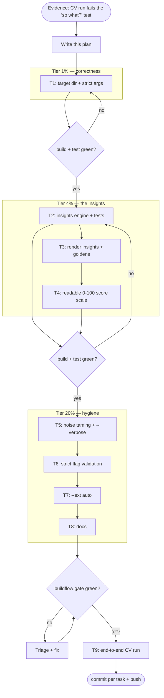

# Pareto Plan — Actionable Insights for go-hotspot

> **Date:** 2026-09-14 19:04 · **Trigger:** Running go-hotspot against `~/projects/CV` produced a
> ranked table, but zero *actionable* insight — and silently analyzed the wrong repo when given a
> positional path.
> **Goal:** Every go-hotspot run should end with answers to "so what should I do?", on the right
> repo, without noise, in language a human can act on.

---

## 1. Evidence — what the CV run exposed

| # | Observation (from `~/projects/CV` run)                                            | Consequence                                                        |
| - | ---------------------------------------------------------------------------------- | ------------------------------------------------------------------ |
| 1 | `go-hotspot ~/projects/CV` **silently ignored** the positional arg and analyzed CWD | Analyzed the wrong repo. A data tool must never do this silently.   |
| 2 | Output is a ranked table + raw coupling list. No "so what?"                        | User still has to do all interpretation themselves.                 |
| 3 | `HOTSPOT 0.000108 critical` — raw normalized scores are unreadable                 | "critical" contradicts the tiny number; destroys trust in output.   |
| 4 | Hundreds of `corruption:analysis.read_failed` warnings for files deleted from disk  | Real signal drowns; stderr unusable for scripting.                  |
| 5 | `--complexity cycolmatic` (typo) silently falls back to `cyclomatic`               | Wrong analysis with no warning — silent fallback is a lie.          |
| 6 | Default `-ext .go` on a mixed repo (md/ts/js/templ) hides ~90% of the code         | Insights cover a fraction of the project.                          |

## 2. Pareto breakdown

**1% → 51% of the result**
Positional target directory + reject unknown arguments. *(Correctness: never silently analyze the wrong repo — this is the difference between insight and misinformation.)*

**4% → 64% of the result**
The 1%, plus an **Insights engine** (Pareto churn concentration, churn-without-complexity anomalies, complexity-without-churn, bus factor, stale hotspots, top coupling advice) rendered into table/markdown/JSON, plus a **human-readable 0–100 relative score** (max file = 100.0; risk bands align: critical ≥ 66).

**20% → 80% of the result**
The 4%, plus:
- Missing-file noise taming: deleted-from-disk files classified separately, one summary line by default, per-path detail behind `--verbose`.
- Strict enum-flag validation: `--format/--sort/--complexity/--churn/--fail-risk` typos are rejected (exit 1) instead of silently defaulting.
- `--ext auto`: curated multi-language code-extension profile so mixed repos are analyzed whole.

**Remaining 80% → 100%** (deliberately NOT in this iteration; stays in TODO_LIST/ROADMAP)
Structured slog wiring, baseline/diff comparisons across runs, function-level insights, SPDX headers, public API extraction, performance (parallel complexity analysis), per-language test-file detection for `--include-tests`.

## 3. Medium-granularity plan (30–100 min tasks, sorted by impact/effort)

| #  | Task                                                                                        | Pareto tier | Impact   | Effort | Customer value                          |
| -- | ------------------------------------------------------------------------------------------- | ----------- | -------- | ------ | --------------------------------------- |
| T1 | Positional `[target]` dir: chdir before pipeline; reject >1 positional arg with usage error | 1%          | Critical | 45min  | Tool can never analyze the wrong repo   |
| T2 | `internal/hotspot/insights.go`: Insight model + 6 rules (concentration, churn≠complexity, complex≠churn, bus factor, stale hotspot, coupling) + unit tests | 4% | Critical | 90min  | The actual "what should I do" answers   |
| T3 | Render insights in table/markdown/JSON (`--no-insights` opt-out), DTO per convention, update goldens | 4% | Critical | 60min  | Insights visible in every human format  |
| T4 | Relative score display: table/markdown show 0–100 (% of max, 1 decimal); CSV/JSON keep raw  | 4%          | High     | 30min  | Scores become self-explanatory          |
| T5 | Noise taming: classify `fs.ErrNotExist` misses vs real analysis errors; summary line; `--verbose` | 20% | High | 45min  | Usable stderr; scripting-friendly       |
| T6 | Strict enum-flag validation (all aliases accepted, typos rejected with valid-value list)    | 20%         | High     | 30min  | No more silently-wrong analyses         |
| T7 | `--ext auto` multi-language profile (curated code extensions; md/json/yml excluded)         | 20%         | Medium   | 45min  | Mixed repos analyzed whole              |
| T8 | Docs: README (flags, score scale, example), FEATURES, AGENTS gotchas, CHANGELOG, TODO_LIST  | 20%         | Medium   | 60min  | Discoverability + honest docs           |
| T9 | Full verification: build/vet/test/lint green + end-to-end run against `~/projects/CV`       | —           | High     | 30min  | Ship with proof, not hope               |

## 4. Fine-grained plan (≤12 min tasks, execution order)

| #     | Task                                                                                  | Parent | Est   |
| ----- | ------------------------------------------------------------------------------------- | ------ | ----- |
| F1.1  | Parse positional args after fs.Parse; >1 → `CLIUsage`                                  | T1     | 10min |
| F1.2  | Validate target: exists + is dir (`CLIUsage` on failure with path in message)          | T1     | 10min |
| F1.3  | Resolve `--output` to absolute path, then `os.Chdir(target)` before pipeline           | T1     | 12min |
| F1.4  | Integration test: run from non-repo temp CWD with repo-subdir target; bad-target tests | T1     | 12min |
| F2.1  | `Insight`/`InsightKind` types + `String()` + doc comment                               | T2     | 10min |
| F2.2  | Concentration rule (top 5% files ↔ share of weighted churn)                            | T2     | 12min |
| F2.3  | Churn-without-complexity + complexity-without-churn quartile rules (guard <4 files)    | T2     | 12min |
| F2.4  | Bus-factor rule (top-quartile churn, single author, cap 5)                             | T2     | 10min |
| F2.5  | Stale-hotspot rule (top-decile score, age > 90d) + coupling advice (top pair ≥60%)     | T2     | 12min |
| F2.6  | Table-driven unit tests for all rules (empty, tiny, synthetic datasets)                | T2     | 12min |
| F3.1  | Thread `insights` through `report.Render` signature; table + markdown sections         | T3     | 12min |
| F3.2  | JSON `insights` array + `jsonInsight` DTO; CSV/graph formats skip                      | T3     | 10min |
| F3.3  | `--no-insights` flag wired in main.go                                                  | T3     | 5min  |
| F3.4  | Update callers (integration test, examples); regenerate goldens; review diff           | T3     | 12min |
| F4.1  | `fmtScoreRel` (0–100, % of max) for table/markdown hotspots; header HOTSPOT→SCORE      | T4     | 10min |
| F4.2  | Functions section relative too; goldens regenerate; README example numbers refresh     | T4     | 12min |
| F5.1  | `errors.Is(err, fs.ErrNotExist)` classification in `analyzeFiles`; missing counter     | T5     | 10min |
| F5.2  | Summary lines: missing + analysis-error counts; `--verbose` prints each path           | T5     | 10min |
| F5.3  | Test: deleted file → no per-path warning by default, path shown with --verbose         | T5     | 12min |
| F6.1  | `validateChoices` for format/sort/complexity/churn (aliases included)                  | T6     | 12min |
| F6.2  | `--fail-risk` validation; table-driven tests: every typo rejected, alias accepted      | T6     | 12min |
| F7.1  | `autoCodeExts` set + `--ext auto` branch + help text                                   | T7     | 10min |
| F7.2  | Test: auto keeps .go/.ts, drops .md/.json; README/AGENTS note                          | T7     | 10min |
| F8.1  | README: positional target, new flags, score scale, insights section                    | T8     | 12min |
| F8.2  | FEATURES (DONE rows), AGENTS (gotchas: chdir, insights, ext auto), CHANGELOG entry      | T8     | 12min |
| F8.3  | TODO_LIST reconciliation (mark done / prune)                                           | T8     | 5min  |
| F9.1  | `buildflow` quality gate: build + vet + test + lint green                              | T9     | 12min |
| F9.2  | End-to-end CV demo run; capture output; final commit + push                            | T9     | 12min |

## 5. Execution graph

## 6. Non-negotiables (Verschlimmbesserung guard)

- Every task lands with build + tests green; goldens regenerated only when output change is *intended* and reviewed in the diff.
- CSV and JSON keep raw normalized scores (machine formats stay stable); only table/markdown become human-scale.
- `--fail-above`/`--fail-risk` semantics unchanged (absolute raw score) — CI users' thresholds keep working.
- No new external dependencies. No signature churn beyond `report.Render` (all callers in-repo).
- Default behaviors change only where the old default was a defect (silent positional ignore, silent enum fallback, per-path deleted-file spam). Everything else is opt-in (`--ext auto`, `--verbose`).

## 7. Explicitly out of scope (recorded for future plans)

slog wiring (TODO_LIST), baseline diff mode, parallel complexity analysis, function-level insights,
per-language test detection, public library API, ownership analytics beyond author counts.
